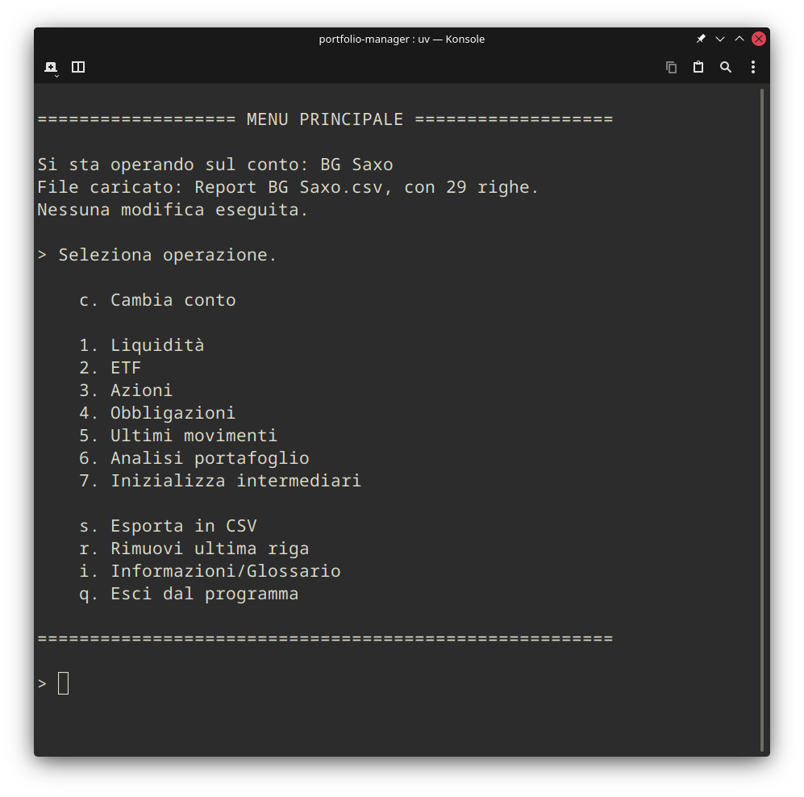
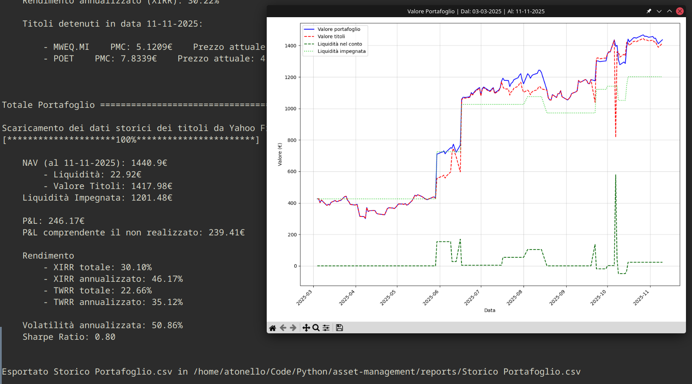
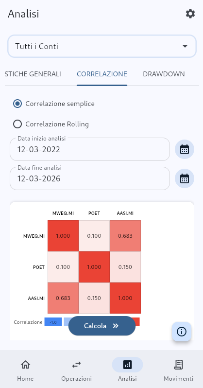
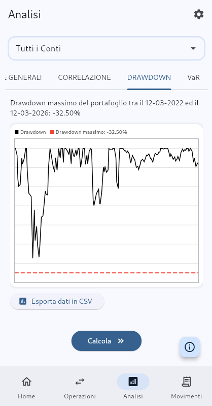
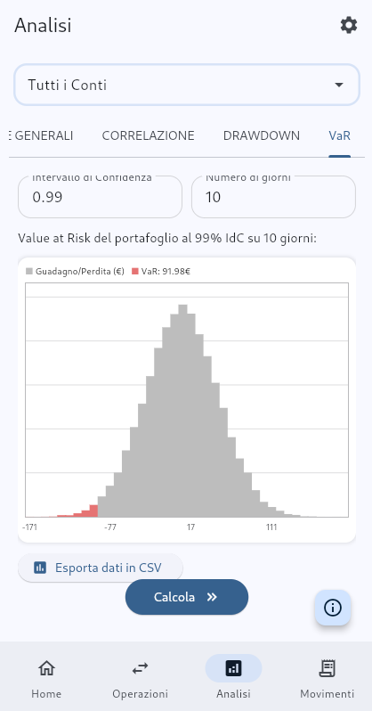
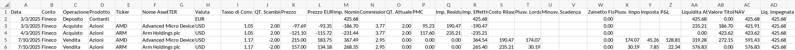
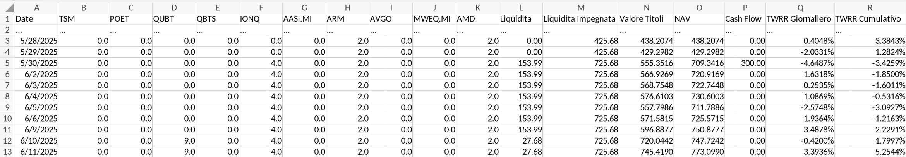

# ITA 🇮🇹 (ENG below)
# Portfolio Manager

Portfolio Manager è un software CLI pensato per la gestione ed analisi di portafogli finanziari (azionario ed ETF), per investitori privati che desiderano tracciare in modo dettagliato le operazioni, la liquidità, il calcolo delle plusvalenze/minusvalenze e la gestione dello zainetto fiscale secondo la normativa italiana.

Sono inoltre disponibili numerosi strumenti di analisi del rischio: VaR (Monte Carlo), analisi volatilità/Sharpe ratio, analisi della correlazione, drawdown.

## Funzionalità principali

- Interfaccia da riga di comando per l'inserimento guidato di nuove operazioni: acquisto, vendita, deposito e prelievo di liquidità, dividendi, imposte
- Calcolo di:
  - Prezzo Medio di Carico
  - Plusvalenze e minusvalenze
  - Zainetto fiscale
  - Scadenza delle minusvalenze secondo la normativa italiana
  - NAV, liquidità attuale e storica
- Salvataggio in tabelle CSV di transazioni e storico del portafoglio
- Tools per analisi di portafoglio, con statistiche e grafici


| Menù Principale                                                      | Statistiche generali del portafoglio                                  |
| -                                                                    | -                                                                     |
|     |     |
|**Correlazione semplice tra asset in portafoglio**                    |**Correlazione rolling tra due asset**                                 |
|     | |
| **Drawdown**                                                         | **Value at Risk**                                                     |
| |       |


## Utilizzo
***Primo avvio***

Al primo avvio sono richiesti la scelta della lingua (Italiano, Inglese) ed il setup dei propri intermediari. Per quanto riguarda questi ultimi, scegliere gli alias che si preferiscono: ad esempio, con due conti Fineco e uno Directa: *Fineco Principale, Fineco 2, Directa*. Gli intermediari potranno inoltre essere aggiunti o rimossi successivamente, ma è da tenere a mente non è possibile "rinominare" un account già salvato; in quel caso, sarà necessario inserire nuovamente tutte le transazioni.

***Utilizzo***

All'avvio del programma verrà sempre richiesto il conto su cui operare. Ad ogni conto è associato un report, ovvero una tabella CSV con le transazioni effettuate. I report vengono salvati con l'opzione apposita (come spiegato in seguito) nella cartella "reports".



*Esempio di un report per il conto "Fineco".*

Successivamente verrà presentato il Menu Principale con le seguenti opzioni:

0. Cambia conto: ri-seleziona il conto su cui operare
1. Operazioni su liquidità: Depositi, Prelievi, Dividendi, Imposte varie (es. Imposta di Bollo)
2. Operazioni su ETF: Acquisto, Vendita
3. Operazioni su Azioni: Acquisto, Vendita
4. Operazioni su Obbligazioni: ***non ancora implementate***
5. Ultimi movimenti: visualizzazione delle ultime dieci righe del report
6. Analisi portafoglio:
    - Statistiche generali (NAV, P&L, rendimento, volatilità...)
    - Analisi correlazione
    - Analisi Drawdown
    - VaR
7. Impostazioni applicazione:
    - Cambia lingua (Italiano, Inglese)
    - Aggiungi conto/i
    - Re-inizializza conti
    - Reset completo dell'applicazione
8. Esporta in csv: salva le modifiche eseguite fino a quel momento
9. Rimuovi ultima riga del report
10. Glossario con:
    - Descrizioni delle colonne dei report
    - Definizioni ed interpretazioni degli strumenti statistici
11. Esci dal programma

Le opzioni di analisi producono grafici da poter salvare su disco. L'opzione 6.1 produce inoltre, nella cartella "reports", uno storico del valore di tutto il portafoglio.



*Esempio dello Storico Portafoglio, comprensivo di tutti i conti salvati.*

Da qualsiasi schermata, è possibile annullare l'operazione corrente e tornare al Menu Principale con CTRL+C / CMD+C.
Come già specificato, le modifiche (comprese la rimozione di righe) sono confermate (salvate) solo manualmente con l'opzione apposita.


## Download / Installazione
#### Download diretto
1. Su questa pagina, clicca su "Release" e scarica il programma per il tuo sistema operativo in una cartella dedicata.
#### Installazione manuale
1. Clona la repository
2. Installa i pacchetti (testato con Python 3.13)
  - `uv`: esegui semplicemente `uv sync` per creare l'enviroment specificato in `pyproject.toml`
  - `pip`: in un environment, installa:
```sh
pip install pandas numpy python-dateutil yfinance matplotlib
```
3. Esegui `main.py`


## Note

- Attenzione: attualmente, gli split azionari ***NON*** sono gestiti
- Attenzione: attualmente, l'inserimento di transazioni è esclusivamente sequenziale

- Il software è pensato per uso personale e didattico. Non costituisce consulenza finanziaria.
- La logica fiscale implementata segue la normativa italiana vigente al 2025, ma si consiglia di verificare sempre con un consulente.

---

# ENG 🇬🇧 🇺🇸
# Portfolio Manager

Portfolio Manager is CLI software designed for the management and analysis of financial portfolios (Stocks and ETFs). It is intended for private investors who wish to track operations, liquidity, capital gains/losses, and manage tax loss carryforwards (*zainetto fiscale*) according to Italian regulations.

Numerous risk analysis tools are also available: VaR (Monte Carlo), volatility/Sharpe ratio analysis, correlation analysis, and drawdown.

## Main Features

- Command line interface for guided entry of new operations: purchases, sales, deposits and withdrawals of liquidity, dividends, and taxes.
- Calculation of:
  - Average Carrying Price (Average Cost Basis)
  - Capital gains and losses
  - Tax Loss Carryforward (*Zainetto fiscale*)
  - Expiration of capital losses according to Italian regulations
  - NAV, current and historical liquidity
- Saving of transactions and portfolio history into CSV tables.
- Portfolio analysis tools, complete with statistics and charts.

| Main Menu                                                            | General Portfolio Statistics                                          |
| -                                                                    | -                                                                     |
|     |     |
|**Simple correlation between assets**                                 |**Rolling correlation between two assets**                             |
|     | |
| **Drawdown**                                                         | **Value at Risk**                                                     |
| |       |


## Usage
***First launch***

Upon the first launch, you will be asked to select a language (English, Italian) and set up your brokers/accounts. Regarding the latter, choose the aliases you prefer: for example, if you have two Fineco accounts and one Directa account, you might use: *Fineco Main, Fineco 2, Directa*. Brokers can be added or removed later, but keep in mind that, once saved, it is not possible to "rename" an account; in that case, you would need to re-enter all transactions.

***Usage***

When the program starts, you will always be asked which account you want to operate on. Each account is associated with a report, which is a CSV table containing the performed transactions. Reports are saved via the specific menu option (explained below) in the "reports" folder.


*Example of a report for the "Fineco" account.*

After that, the Main Menu will be presented with the following options:

0. Change account: Re-select the account to operate on.
1. Cash operations: Deposits, Withdrawals, Dividends, various Taxes (e.g., Stamp Duty).
2. ETF Operations: Buy, Sell.
3. Stock Operations: Buy, Sell.
4. Bond Operations: ***not yet implemented***.
5. Latest movements: View the last ten rows of the report.
6. Portfolio Analysis:
    - General statistics (NAV, P&L, return, volatility...)
    - Correlation analysis
    - Drawdown analysis
    - VaR
7. Application Settings:
    - Change language (Italian, English)
    - Add account(s)
    - Re-initialize accounts
    - Full application reset
8. Export to CSV: Saves changes made up to that point.
9. Remove last row of the report.
10. Glossary containing:
    - Descriptions of report columns
    - Definitions and interpretations of statistical analysis tools
11. Exit the program.

The analysis options produce charts that can be saved to disk. Option 6.1 also produces a history of the total portfolio value in the "reports" folder.


*Example of Portfolio History, including all saved accounts.*

From any screen, you can cancel the current operation and return to the Main Menu using `CTRL+C` / `CMD+C`.
As previously specified, changes (including the removal of rows) are confirmed (saved) only manually using the specific menu option.


## Download / Installation
#### Direct Download
1. On this page, click on "Releases" and download the program for your operating system into a dedicated folder.
#### Manual Installation
1. Clone the repository.
2. Install packages (tested with Python 3.13).
  - `uv`: Simply run `uv sync` to create the environment specified in `pyproject.toml`.
  - `pip`: In an environment, install:
```sh
pip install pandas numpy python-dateutil yfinance matplotlib
```
3. Run `main.py`


## Notes

- Warning: Currently, stock splits are NOT handled.
- Warning: Currently, transaction entry is exclusively sequential.

- The software is intended for personal and educational use. It does not constitute financial advice.
- The fiscal logic implemented follows the Italian regulations in force as of 2025, but it is always advisable to verify with a consultant.
