# ITA 🇮🇹 (ENG below)
# Portfolio Manager

Portfolio Manager è un'applicazione GUI multipiattaforma per la gestione ed analisi di portafogli finanziari (azioni ed ETF), pensata per investitori privati che desiderano tracciare in modo dettagliato le proprie operazioni, la liquidità, il calcolo delle plusvalenze/minusvalenze e la gestione dello zainetto fiscale secondo la normativa italiana.

Sono inoltre disponibili strumenti di analisi: VaR (Monte Carlo), volatilità/Sharpe ratio, correlazione, drawdown, XIRR e TWRR.

Realizzata con [Flet](https://flet.dev/), è pensata principalmente per uso mobile (Android, iOS), ma supporta anche Linux, macOS, Windows.


## Funzionalità principali

- **Gestione multi-conto**: supporto a più account con alias personalizzabili
- **Operazioni su liquidità**: depositi, prelievi, dividendi, imposte e commissioni
- **Operazioni su titoli**: acquisto e vendita di azioni ed ETF, con gestione valuta (EUR/USD), commissioni e TER
- **Calcolo automatico di**:
  - Prezzo Medio di Carico (PMC)
  - Plusvalenze e minusvalenze realizzate e non
  - Zainetto fiscale con scadenza delle minusvalenze
  - NAV, liquidità corrente e storica
- **Panoramica del portafoglio** con posizioni aperte, P&L e prezzi in tempo reale (Yahoo Finance)
- **Watchlist** di titoli personalizzabile
- **Esportazione CSV** delle transazioni con intestazioni localizzate
- **Strumenti di analisi del rischio** (dettagli sotto)
- **Multilingua**: italiano e inglese

| Home                                                                    | Home (Dark theme, Hidden data, English)                                | Settings                                                                |
| -                                                                       | -                                                                      | -                                                                       |
| 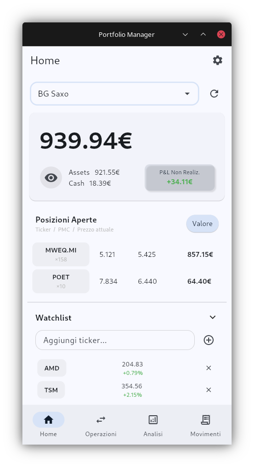 | 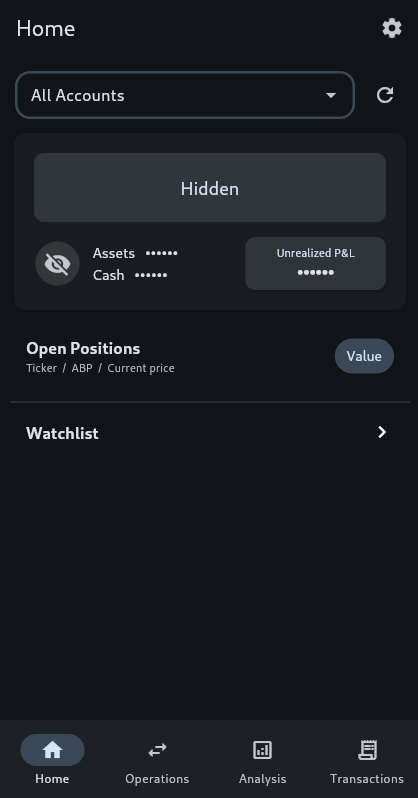 | 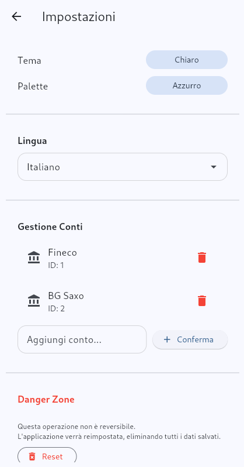   |
| **Operations**                                                          | **Transactions**                                                       | **Statistics**                                                          |
| 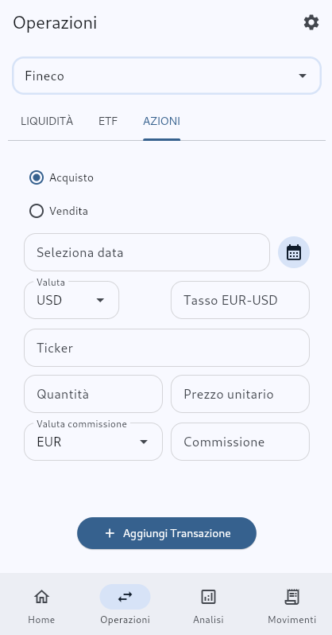 | 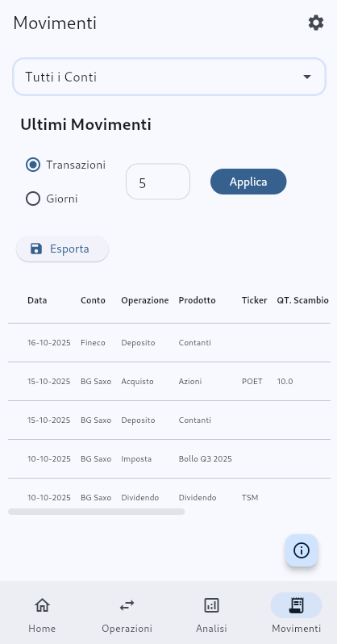     | 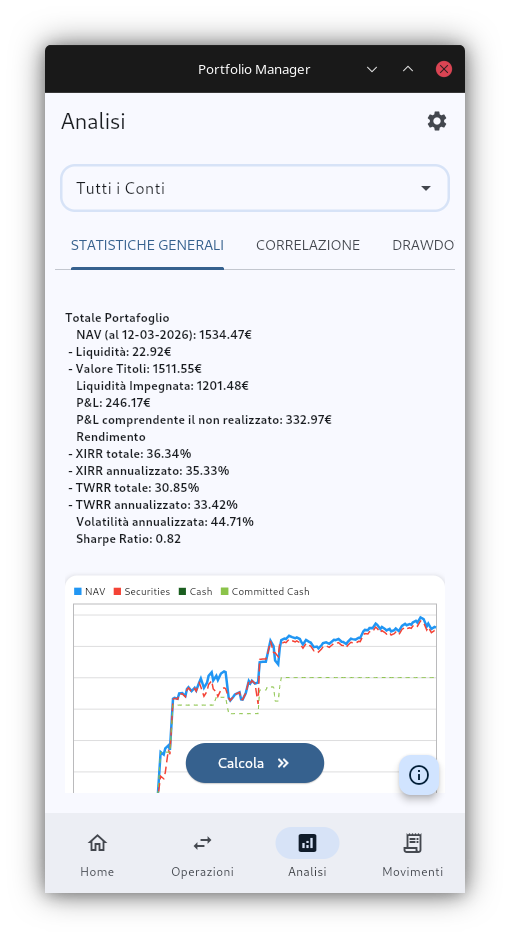 |
| **Correlation**                                                         | **Drawdown**                                                           | **Value at Risk**                                                       |
| 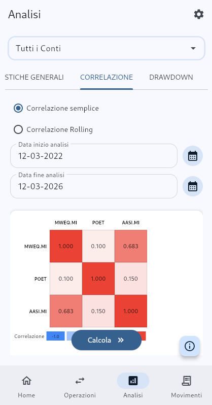       | 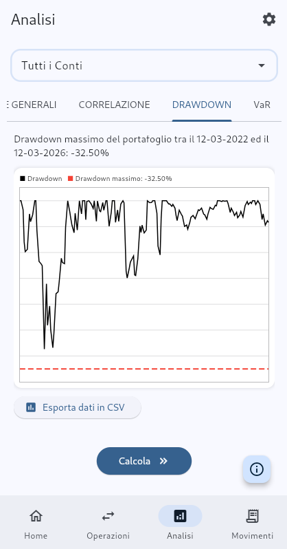  | 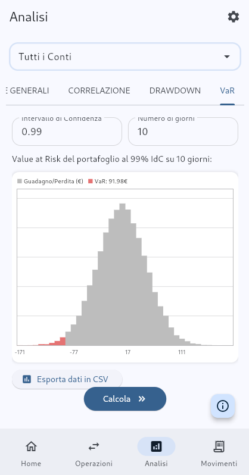        |


## Applicazione

Quattro schermate principali:

- **Home**: Panoramica conto, posizioni aperte, watchlist
- **Operazioni**: Inserimento di nuove transazioni, supporto EUR/USD
    - *Liquidità* (depositi, prelievi, dividendi, imposte)
    - *ETF Azionari* (acquisto/vendita) 
    - *Azioni* (acquisto/vendita)
    - In programma: *ETF Monetari / Obbligazionari, Obbligazioni*
- **Analisi**: strumenti per l'analisi del portafoglio. È presente un tasto Info per ogni strumento, con informazioni a riguardo.
    - *Statistiche generali*: principali statistiche del portafoglio con grafico
    - *Correlazione*: correlazione semplice tra asset in portafoglio e correlazione rolling tra due asset selezionati
    - *Drawdown*: calcolo e grafico del Drawdown del portafoglio
    - *Value at Risk*: simulazione Monte Carlo su serie storiche con intervallo di confidenza e orizzonte temporale personalizzabili
- **Transazioni**: storico delle transazioni filtrabile + esportazione in tabella CSV. È presente un tasto Info con informazioni riguardo le colonne del report.


## Primo avvio

1. **Scelta della lingua**: italiano o inglese
2. **Setup dei conti**: inserimento degli alias dei propri intermediari (es. *Fineco Principale, Fineco 2, Directa*). I conti possono essere aggiunti o rimossi successivamente dalle impostazioni. Non è possibile rinominare un conto esistente.

Le transazioni vengono salvate automaticamente ad ogni inserimento.


## Installazione
### Download diretto
1. Nella sezione "Releases", scarica il programma per il tuo sistema operativo.

### Installazione manuale
1. Clona la repository
2. Installa i pacchetti (richiesto Python >= 3.11, testato con 3.13):
    - `uv`: esegui `uv sync`
    - `pip`:
```sh
pip install flet flet-charts pandas numpy yfinance python-dateutil
```
3. (Opzionale) Per testare l'applicazione: 
  - `uv`: `uv run flet run main.py`
  - `pip`: `python main.py` oppure `flet run`

4. Build dell'applicazione:
  - `uv`: `uv run flet build <target> --project "Portfolio Manager"`
  - `pip`: `flet build <target> --project "Portfolio Manager"`
  - `<target>` == `apk`, `ios`, `linux`, `macos`, `windows`


## Note

- Gli split azionari **non** sono attualmente gestiti
- L'inserimento delle transazioni è esclusivamente sequenziale (cronologico)
- Il software è pensato per uso personale e didattico. Non costituisce consulenza finanziaria
- La logica fiscale segue la normativa italiana vigente al 2026; si consiglia sempre la verifica con un consulente

---

# ENG 🇬🇧 🇺🇸
# Portfolio Manager

Portfolio Manager is a cross-platform GUI application for managing and analyzing financial portfolios (stocks and ETFs). It is designed for private investors who wish to track their operations, liquidity, capital gains/losses, and manage tax loss carryforwards (*zainetto fiscale*) according to Italian regulations.

It also includes several analysis tools: VaR (Monte Carlo), volatility/Sharpe ratio, correlation, drawdown, XIRR and TWRR.

Built with [Flet](https://flet.dev/), it is mobile-focused (Android, iOS) but it also supporsts Linux, macOS, Windows

## Main Features

- **Multi-account management**: support for multiple brokers with custom aliases
- **Cash operations**: deposits, withdrawals, dividends, taxes and charges
- **Securities operations**: buy and sell stocks and ETFs, with currency handling (EUR/USD), fees and TER
- **Automatic calculation of**:
  - Average Cost Basis (ACB)
  - Realized and unrealized capital gains/losses
  - Tax loss carryforward with expiry tracking
  - NAV, current and historical liquidity
- **Portfolio overview** with open positions, P&L and live prices (Yahoo Finance)
- **Customizable watchlist**
- **CSV export** of transactions with localized column headers
- **Risk analysis tools** (details below)
- **Customizable themes**: light, dark or system, with 8 color palettes
- **Multilingual**: English and Italian

| Portfolio overview                                                   | Statistics                                                            |
| -                                                                    | -                                                                     |
| 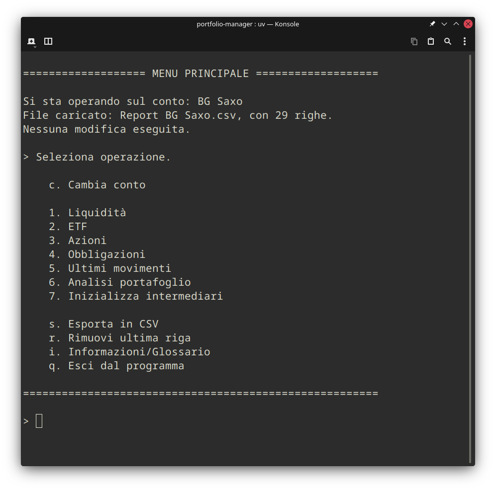    | 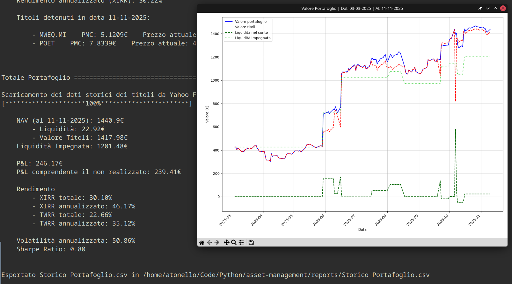    |
|**Simple correlation**                                                |**Rolling correlation**                                                |
|     |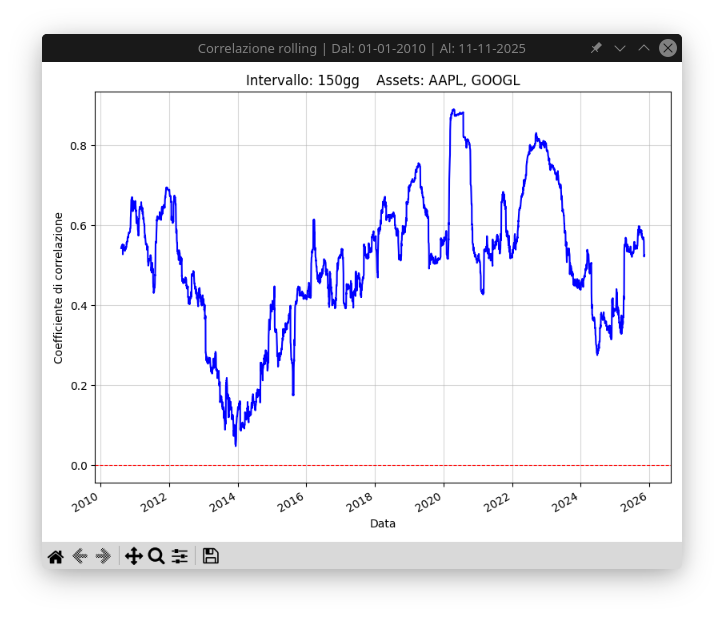 |
| **Drawdown**                                                         | **Value at Risk**                                                     |
| |       |


## App Structure

The app has four main screens accessible from the bottom navigation bar, plus a settings screen:

### Home
- Account selector (single account or all-accounts overview)
- Open positions with current price, average cost basis, unrealized P&L and daily change
- Watchlist with live prices
- Option to hide values

### Operations
- Guided entry of new transactions
- Three tabs: **Cash** (deposits, withdrawals, dividends, taxes), **ETF** (buy/sell), **Stock** (buy/sell)
- Currency selection (EUR/USD) with exchange rate
- Fees and TER (for ETFs)

### Transactions
- Full transaction history per account or across all accounts
- Filter by transaction count or by number of days
- CSV export with column headers in the selected language

### Analysis
- **Summary statistics**: NAV, P&L, committed cash, XIRR (full and annualized), TWRR (full and annualized), annualized volatility, Sharpe ratio
- **Correlation**: correlation matrix of portfolio holdings and rolling correlation between two selected assets
- **Drawdown**: Maximum Drawdown (MDD) calculation and chart
- **Value at Risk**: Monte Carlo simulation (50,000 iterations) with customizable confidence interval and time horizon

### Settings
- Language (English / Italian)
- Theme (light / dark / system) and color palette
- Account management: add and delete brokers
- Full application reset


## First Launch

1. **Language selection**: English or Italian
2. **Account setup**: enter aliases for your brokers (e.g., *Fineco Main, Fineco 2, Directa*). Accounts can be added or removed later from Settings. Existing accounts cannot be renamed.

Transactions are saved automatically as they are entered.


## Installation
#### Direct Download
1. In the "Releases" section, download the program for your operating system.

#### Manual Installation
1. Clone the repository
2. Install packages (requires Python >= 3.11, tested with 3.13):
  - `uv`: run `uv sync`
  - `pip`:
```sh
pip install flet flet-charts pandas numpy yfinance python-dateutil
```
3. Run `python main.py` or `flet run`


## Notes

- Stock splits are **not** currently handled
- Transaction entry is exclusively sequential (chronological)
- This software is intended for personal and educational use. It does not constitute financial advice
- The fiscal logic follows Italian regulations in force as of 2026; always verify with a professional advisor
